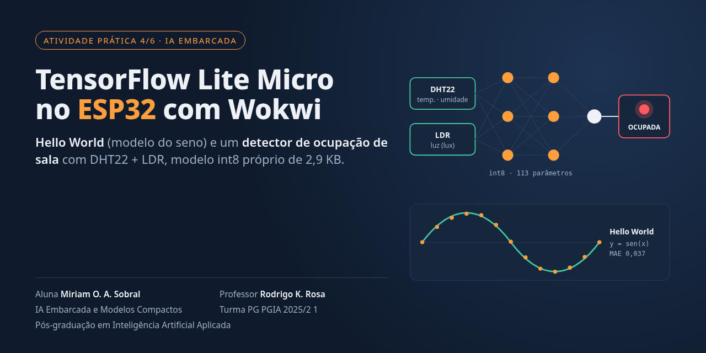
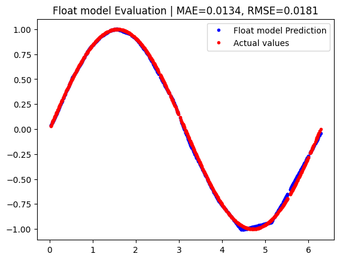
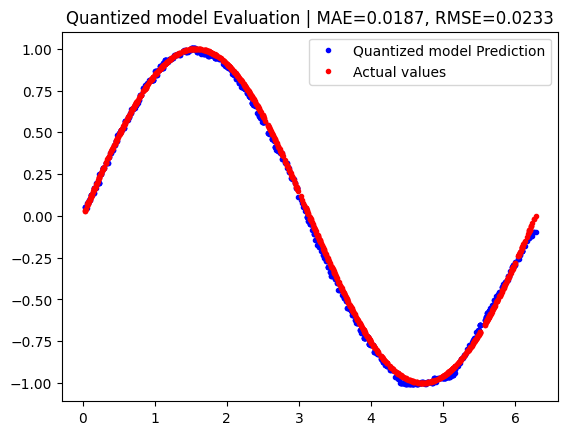
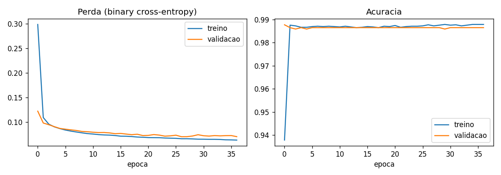
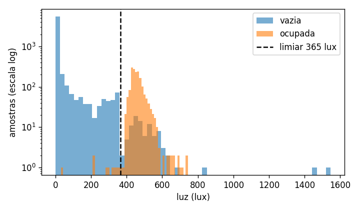
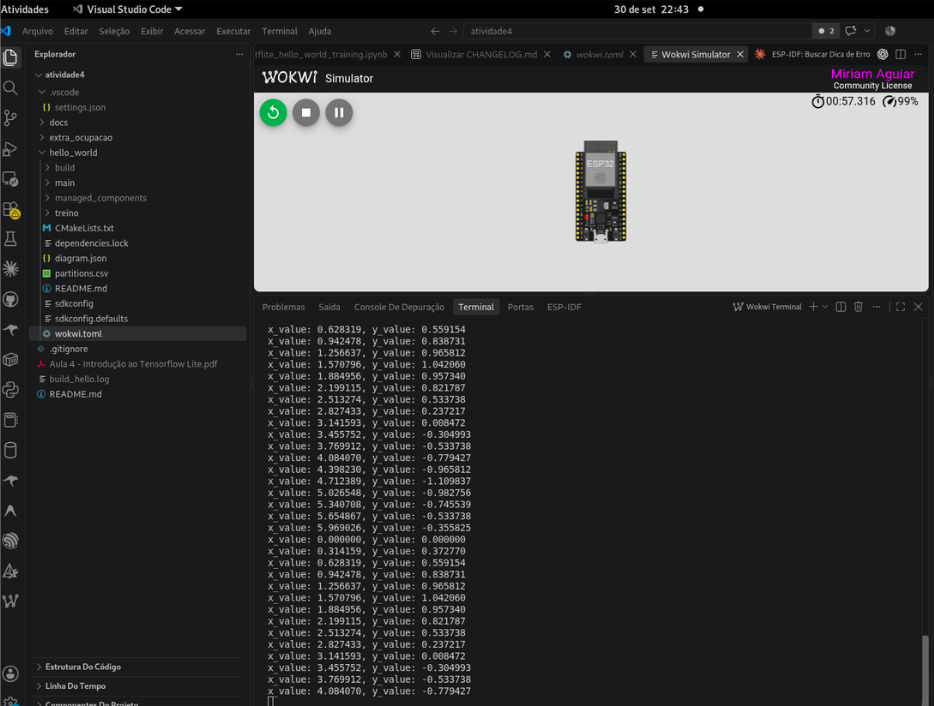
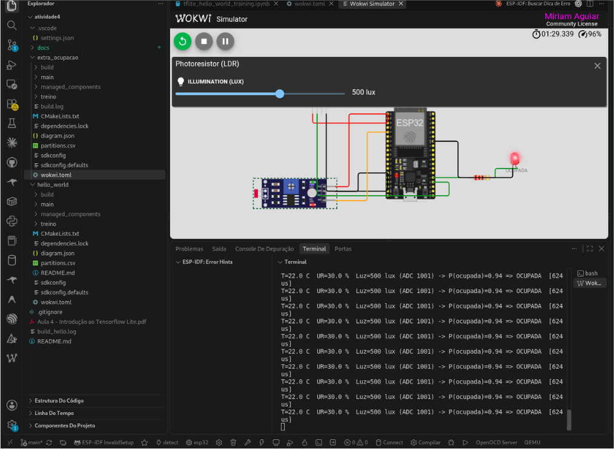
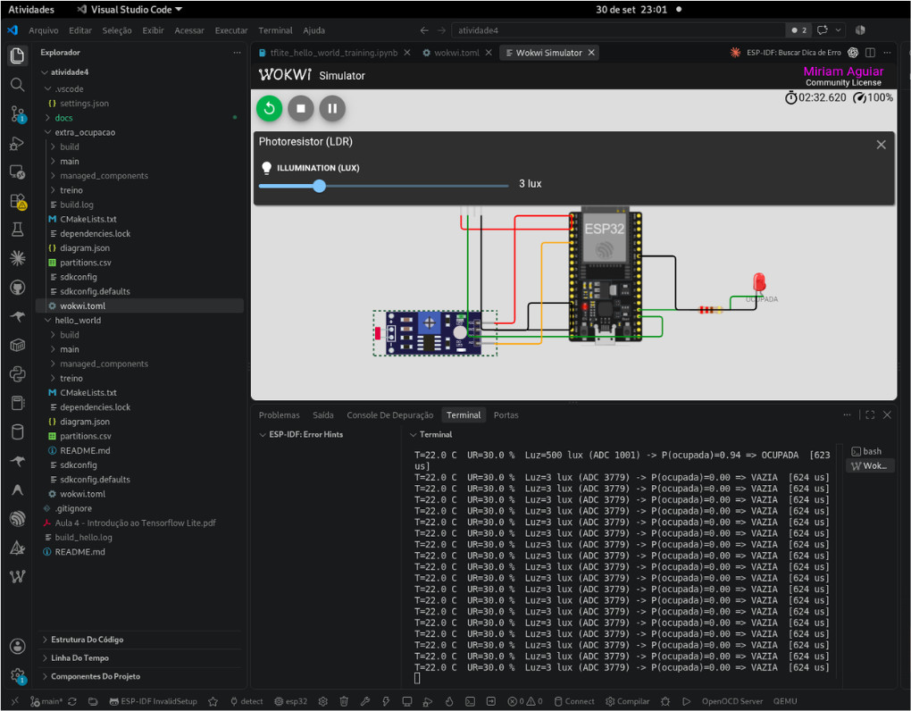

<p align="center"></p>

<p align="center">
  <b>Repositório público:</b> <a href="https://github.com/eumoas/sistemaembarcado-tflite-helloworld">github.com/eumoas/sistemaembarcado-tflite-helloworld</a><br>
  <b>Relatório em PDF:</b> <a href="docs/Relatorio_Atividade4_TFLite_Miriam_Sobral.pdf">docs/Relatorio_Atividade4_TFLite_Miriam_Sobral.pdf</a>
</p>

| | |
|---|---|
| **Curso** | Pós-graduação em Inteligência Artificial Aplicada |
| **Turma** | PG PGIA 2025/2 1 |
| **Unidade Curricular** | IA Embarcada e Modelos Compactos — 489780 |
| **Professor** | Rodrigo K. Rosa |
| **Aluna** | Miriam O. A. Sobral |
| **Atividade** | Atividade Avaliativa Prática (4/6) — Aula 4: Introdução ao TensorFlow Lite |
| **Repositório** | [eumoas/sistemaembarcado-tflite-helloworld](https://github.com/eumoas/sistemaembarcado-tflite-helloworld) |

# TensorFlow Lite Micro no ESP32 com Wokwi: Hello World e Detector de Ocupação

Relatório da unidade curricular **IA Embarcada e Modelos Compactos**, Aula 4 (Introdução ao TensorFlow Lite). A atividade tem duas partes:

1. **Hello World do TensorFlow Lite Micro** (exemplo `esp-tflite-micro`): uma rede neural que aproxima a função seno, compilada com o **ESP-IDF 5.5** e executada no **Wokwi** (não foi usada placa física).
2. **Extra: detector de ocupação de sala.** É uma aplicação nova, com **sensores novos** (DHT22 e fotoresistor/LDR), **dataset novo** (UCI Occupancy Detection) e **modelo próprio** treinado, quantizado em int8 e executado no ESP32 com o TFLite Micro.

**Resultados validados**

| Item | Resultado |
|---|---|
| Hello World compilado (ESP32, ESP-IDF 5.5, ESP-NN desativado) | `hello_world.bin` = 205 184 bytes, 90 % da partição livre |
| Extra compilado | `ocupacao_sala.bin` = 225 984 bytes, 89 % da partição livre |
| Modelo seno: erro do int8 em relação ao float | MAE 0,0187 contra 0,0134 |
| Detector de ocupação: acurácia do modelo **int8** | **97,9 %** (teste 1) e **99,3 %** (teste 2) |
| Modelo de ocupação | 113 parâmetros, **2 920 bytes** em `.tflite` int8 |
| Concordância entre o modelo float32 e o int8 | 100 % das 12 417 amostras de teste |
| Hello World **no Wokwi** | `y_value` acompanha o seno; MAE de 0,037 nos 20 pontos de um período ([Figura 1](#8-evidências)) |
| Extra **no Wokwi** | 3 lux → VAZIA (P = 0,00); 500 lux → OCUPADA (P = 0,94); inferência em **624 µs** ([Figuras 2 a 4](#8-evidências)) |

## Sumário

- [Enunciado](#enunciado)
- [1. Atendimento aos requisitos](#1-atendimento-aos-requisitos)
- [2. Estrutura do repositório](#2-estrutura-do-repositório)
- [3. Ambiente](#3-ambiente)
- [4. Parte 1: Hello World passo a passo](#4-parte-1-hello-world-passo-a-passo)
- [5. Relatório: análise do código e da documentação](#5-relatório-análise-do-código-e-da-documentação)
- [6. Extra: detector de ocupação de sala](#6-extra-detector-de-ocupação-de-sala)
- [7. Como reproduzir tudo](#7-como-reproduzir-tudo)
- [8. Evidências](#8-evidências)
- [9. Dificuldades e soluções](#9-dificuldades-encontradas-e-soluções)
- [10. Referências](#10-referências)
- [Identificação](#identificação)

## Enunciado

**Atividade Avaliativa Prática (4/6)** — IA Embarcada e Modelos Compactos, Prof. Rodrigo K. Rosa

*Condições de conclusão:*

- Reproduza os passos do Hello World;
- Print da tela do Wokwi rodando o Hello World;
- Análise do código e documentação em um breve relatório sobre as observações encontradas.

**Extra (+1 ponto nas atividades práticas):**

- Modifique o código para uma nova aplicação, com novo sensor e novo dataset;
- Não pode ser um outro exemplo do esp-tflite-micro, exceto na condição de realizar um novo retreino/finetuning do modelo para novas funcionalidades.

## 1. Atendimento aos requisitos

| Requisito | Onde está |
|---|---|
| Reproduzir os passos do Hello World | [Seção 4](#4-parte-1-hello-world-passo-a-passo), pasta [hello_world/](hello_world/) |
| Print do Wokwi rodando o Hello World | [Seção 8](#8-evidências), Figura 1, analisada na [Seção 4.6](#46-simular-no-wokwi-vs-code) |
| Relatório com análise do código e da documentação | [Seção 5](#5-relatório-análise-do-código-e-da-documentação) |
| Extra: novo sensor | DHT22 (temperatura e umidade) e módulo fotoresistor/LDR (luz), [Seção 6.5](#65-circuito-no-wokwi) |
| Extra: novo dataset | UCI Occupancy Detection, com 20 560 medições reais de um escritório, [Seção 6.2](#62-dataset) |
| Extra: modelo próprio, não é outro exemplo | Rede treinada do zero em [treinar_modelo.py](extra_ocupacao/treino/treinar_modelo.py), [Seção 6.3](#63-treinamento-do-modelo) |
| Extra: aplicação funcionando | Prints do Wokwi com sala ocupada, vazia e leitura fora da faixa, [Seção 6.6](#66-testes-no-wokwi) e Figuras 2 a 4 |

## 2. Estrutura do repositório

```text
.
├── README.md                     ← este relatório
├── docs/imagens/                 ← prints do Wokwi e gráficos
├── hello_world/                  ← Parte 1: exemplo oficial do esp-tflite-micro
│   ├── CMakeLists.txt            ← remove a flag -DESP_NN (necessário para o Wokwi)
│   ├── diagram.json              ← circuito do Wokwi (só o ESP32)
│   ├── wokwi.toml                ← diz ao Wokwi qual firmware carregar
│   ├── main/                     ← código do exemplo (main.cc, main_functions.cc, model.cc…)
│   └── treino/                   ← notebook de treino do modelo seno (Colab)
└── extra_ocupacao/               ← Parte 2: aplicação nova
    ├── CMakeLists.txt
    ├── diagram.json              ← ESP32 + DHT22 + LDR + LED
    ├── wokwi.toml
    ├── main/
    │   ├── main.cc               ← app_main: chama setup() e loop() a cada 2 s
    │   ├── main_functions.cc     ← leitura dos sensores + inferência TFLite Micro
    │   ├── dht22.c / .h          ← driver do DHT22 (protocolo de um fio)
    │   ├── ldr.c / .h            ← leitura do LDR pelo ADC e conversão para lux
    │   ├── model.cc / .h         ← modelo .tflite como array C (gerado com xxd)
    │   └── model_params.h        ← normalização e quantização (gerado pelo treino)
    └── treino/
        ├── treinar_modelo.py     ← treino, quantização, avaliação e geração do model.cc
        ├── dados/                ← dataset UCI Occupancy Detection
        └── resultados/           ← métricas, gráficos e o .tflite
```

As pastas `build/` e `managed_components/` não vão para o Git: o ESP-IDF recria as duas no `idf.py build`.

## 3. Ambiente

| Ferramenta | Versão / observação |
|---|---|
| ESP-IDF | 5.5, pela imagem Docker oficial `espressif/idf:v5.5` |
| Biblioteca | `espressif/esp-tflite-micro` 1.4.1, que traz o `espressif/esp-nn` 1.4.1 |
| Placa simulada | ESP32 DevKitC V4 (`board-esp32-devkit-c-v4`) |
| Simulador | Wokwi para VS Code |
| Treino | Python 3.9, TensorFlow 2.20 (extra) e Google Colab (Hello World) |

**Por que Docker?** A imagem `espressif/idf:v5.5` já vem com o compilador `xtensa-esp32-elf-gcc`, o Python e o `idf.py` configurados. Assim não é preciso instalar nada do ESP-IDF no sistema. Para compilar uma pasta:

```bash
docker run --rm -u $(id -u):$(id -g) -e HOME=/tmp \
  -v "$PWD":/project -w /project/hello_world espressif/idf:v5.5 idf.py build
```

- `-v "$PWD":/project` mostra a pasta do repositório dentro do container.
- `-u $(id -u):$(id -g)` faz os arquivos gerados pertencerem ao seu usuário, e não ao `root`.
- `-e HOME=/tmp` dá ao gerenciador de componentes uma pasta com permissão de escrita para o cache.

## 4. Parte 1: Hello World passo a passo

O Hello World é o "primeiro programa" do TensorFlow Lite Micro. Uma rede neural pequena aprende a função **y = sen(x)** para x entre 0 e 2π. No microcontrolador, o programa varre esses valores de x, roda o modelo e imprime o y previsto. A documentação recomenda usá-lo **como base para novos projetos**, e foi o que a Parte 2 fez.

### 4.1 Adicionar a biblioteca e copiar o exemplo

A biblioteca entra como **componente gerenciado** do ESP-IDF, declarada em [hello_world/main/idf_component.yml](hello_world/main/idf_component.yml):

```yaml
dependencies:
  espressif/esp-tflite-micro:
    version: '*'
```

No primeiro `idf.py build`, o gerenciador de componentes baixa o `esp-tflite-micro` e a dependência dele, o `esp-nn`, para `managed_components/`. As versões resolvidas ficam registradas em [dependencies.lock](hello_world/dependencies.lock) (as duas na 1.4.1). Depois, a pasta `main/` do exemplo foi copiada de `managed_components/espressif__esp-tflite-micro/examples/hello_world/main`, como no slide da aula. Uma comparação com `diff -r` confirmou que os arquivos são idênticos aos do exemplo.

### 4.2 Treinar o modelo, quantizar e gerar o `model.cc`

O notebook [hello_world/treino/tflite_hello_world_training.ipynb](hello_world/treino/tflite_hello_world_training.ipynb) adapta os scripts `train.py`, `evaluate.py` e a quantização do repositório `tflite-micro`, e foi executado no Google Colab:

1. **Dados.** Gera valores de x em [0, 2π], calcula sen(x) e soma um ruído pequeno, simulando medições reais.
2. **Treino.** Rede densa 1 → 16 → 16 → 1, treinada por 300 épocas.
3. **Conversão.** Gera um `.tflite` float e um `.tflite` **int8** (quantização pós-treino).
4. **Avaliação.** Compara os dois com o seno verdadeiro.

| Modelo | MAE | RMSE |
|---|---|---|
| float32 | 0,0134 | 0,0181 |
| int8 (quantizado) | 0,0187 | 0,0233 |

A quantização aumentou o erro médio em só 0,005, e em troca o modelo fica cerca de 4× menor e roda com aritmética inteira, que é mais rápida em microcontroladores.

<p align="center"> </p>
<p align="center"><em>Figura A: previsões do modelo float (esquerda) e int8 (direita) contra o seno verdadeiro.</em></p>

> **Observação importante.** O firmware do Hello World usa o `model.cc` **original do exemplo** (2 488 bytes, idêntico ao do `esp-tflite-micro`). O notebook reproduz o **processo** de treino, quantização e avaliação mostrado na aula, mas o `.tflite` gerado no Colab não foi copiado para o firmware. Por isso os erros medidos no Wokwi ([4.6](#46-simular-no-wokwi-vs-code)) são do modelo do exemplo, e não os da tabela acima. O ciclo completo "treinar → converter → `xxd` → firmware" com um modelo **próprio** foi feito no extra ([Seção 6](#6-extra-detector-de-ocupação-de-sala)).

O último passo transforma o `.tflite` em código C com o `xxd`, como no slide:

```bash
xxd -i converted_model.tflite > model_data.cc
```

**Por que isso é necessário?** O ESP32 não tem sistema de arquivos para "abrir" um `.tflite`. Por isso o modelo vira um array `const unsigned char g_model[]`, que é gravado na **flash** junto com o programa. O `model.cc` do exemplo tem 2 488 bytes.

### 4.3 Criar o `diagram.json` e o `wokwi.toml`

O [diagram.json](hello_world/diagram.json) descreve o circuito do Wokwi. No Hello World, é só o ESP32 com o TX/RX ligado ao monitor serial:

```json
"parts": [ { "type": "board-esp32-devkit-c-v4", "id": "esp", ... } ],
"connections": [ [ "esp:TX", "$serialMonitor:RX", "", [] ],
                 [ "esp:RX", "$serialMonitor:TX", "", [] ] ]
```

O [wokwi.toml](hello_world/wokwi.toml) diz ao Wokwi onde está o firmware. O `elf` leva o nome do projeto, conforme o slide:

```toml
[wokwi]
version = 1
firmware = 'build/flasher_args.json'
elf = 'build/hello_world.elf'
```

Apontar para o `flasher_args.json` faz o Wokwi carregar o bootloader, a tabela de partições e a aplicação nos endereços certos.

### 4.4 Desativar o ESP-NN (modificação para o Wokwi)

O **ESP-NN** é uma biblioteca da Espressif com versões otimizadas das operações de redes neurais (convolução, camada densa etc.). No ESP32-S3, ela usa instruções vetoriais especiais do processador. **O Wokwi não simula essas otimizações**, então o slide manda comentar esta linha no `CMakeLists.txt` do `esp-tflite-micro`:

```cmake
# enable ESP-NN optimizations by Espressif
target_compile_options(${COMPONENT_LIB} PRIVATE -DESP_NN)
```

**O que essa linha faz:** define a macro `ESP_NN` ao compilar a biblioteca. Os kernels em `tensorflow/lite/micro/kernels/esp_nn/*.cc` têm trechos `#if ESP_NN … #else … #endif`. Com a macro definida, eles chamam as funções otimizadas. Sem ela, usam a **implementação de referência** do TFLite Micro, em C puro, que o Wokwi executa normalmente.

**Como foi feito aqui:** editar a pasta `managed_components/` funciona, mas a edição se perde quando o ESP-IDF baixa o componente de novo, e essa pasta não vai para o Git. Por isso a **mesma flag** foi removida no [CMakeLists.txt do projeto](hello_world/CMakeLists.txt), logo depois do `project()`:

```cmake
idf_component_get_property(tflite_lib espressif__esp-tflite-micro COMPONENT_LIB)
get_target_property(tflite_opts ${tflite_lib} COMPILE_OPTIONS)
list(REMOVE_ITEM tflite_opts -DESP_NN)
set_property(TARGET ${tflite_lib} PROPERTY COMPILE_OPTIONS ${tflite_opts})
```

O resultado é equivalente ao do slide, e quem clonar o repositório não precisa editar nada à mão. Para confirmar, a busca por `-DESP_NN` no `build/compile_commands.json` (o arquivo com os comandos de compilação de cada `.cc`) retornou **0 ocorrências**.

### 4.5 Compilar

```bash
cd hello_world
idf.py build        # (ou o comando docker da seção 3)
```

```text
hello_world.bin binary size 0x32180 bytes. Smallest app partition is 0x1e0000 bytes. 0x1ade80 bytes (90%) free.
Project build complete.
```

A compilação passou por 1 242 etapas, a maior parte delas para compilar o TensorFlow Lite Micro, e terminou **sem erros**.

### 4.6 Simular no Wokwi (VS Code)

1. Abra a pasta `hello_world/` no VS Code (ou o arquivo `hello_world/wokwi.toml`).
2. **Ctrl + Shift + P** → **Wokwi: Start Simulator**. Se houver mais de um projeto, use antes **Wokwi: Select Config File** e escolha `hello_world/wokwi.toml`.
3. O monitor serial passa a mostrar uma linha a cada 500 ms:

```text
x_value: <x>, y_value: <seno previsto pelo modelo>
```

#### Resultado obtido no Wokwi

A simulação rodou como esperado ([Figura 1](#8-evidências)). O circuito mostra só o ESP32, e o terminal imprime um par `x_value`/`y_value` a cada 500 ms. A tabela traz **um período completo** copiado do print (20 inferências, porque `kInferencesPerCycle = 20`), comparado com o seno calculado na calculadora:

| x (`x_value`) | y no ESP32 (`y_value`) | sen(x) real | erro absoluto |
|---|---|---|---|
| 0,000000 | 0,000000 | 0,000000 | 0,0000 |
| 0,314159 | 0,372770 | 0,309017 | 0,0638 |
| 0,628319 | 0,559154 | 0,587786 | 0,0286 |
| 0,942478 | 0,838731 | 0,809017 | 0,0297 |
| 1,256637 | 0,965812 | 0,951056 | 0,0148 |
| 1,570796 | 1,042060 | 1,000000 | 0,0421 |
| 1,884956 | 0,957340 | 0,951056 | 0,0063 |
| 2,199115 | 0,821787 | 0,809017 | 0,0128 |
| 2,513274 | 0,533738 | 0,587785 | 0,0540 |
| 2,827433 | 0,237217 | 0,309017 | 0,0718 |
| 3,141593 | 0,008472 | -0,000000 | 0,0085 |
| 3,455752 | -0,304993 | -0,309017 | 0,0040 |
| 3,769912 | -0,533738 | -0,587786 | 0,0540 |
| 4,084070 | -0,779427 | -0,809017 | 0,0296 |
| 4,398230 | -0,965812 | -0,951057 | 0,0148 |
| 4,712389 | -1,109837 | -1,000000 | 0,1098 |
| 5,026548 | -0,982756 | -0,951057 | 0,0317 |
| 5,340708 | -0,745539 | -0,809017 | 0,0635 |
| 5,654867 | -0,533738 | -0,587785 | 0,0540 |
| 5,969026 | -0,355825 | -0,309017 | 0,0468 |

**Análise dos valores:**

- **O modelo reproduz o seno.** O `y` sobe até ~1 em x = π/2, cruza o zero em x = π (0,008), desce até ~-1 em x = 3π/2 e volta. Depois de x = 5,969, o `x` recomeça em 0 (`inference_count` volta a zero) e a sequência se repete idêntica, como se vê no print.
- **Erro médio absoluto (MAE) de 0,037 e RMSE de 0,046.** O maior erro (0,110) fica no vale, x = 3π/2, onde o modelo previu -1,110, ou seja, passou de -1. Os pontos de pico e vale são as regiões mais difíceis para a rede pequena.
- **A saída é "em degraus".** Todos os `y_value` são múltiplos de **0,008472**, que é a escala (`scale`) do tensor de saída int8 do modelo. Em x = π, o valor 0,008472 é exatamente **um degrau** acima de zero. Valores como 0,533738 e 0,965812 se repetem (com sinal trocado) em pontos simétricos. Com 8 bits, a saída só pode assumir 256 valores, e é isso que a tabela mostra: é a quantização int8 vista na prática.
- **O Wokwi executou o mesmo modelo que o PC.** O mesmo `model.cc` foi rodado no interpretador TFLite do Python com a mesma conta de quantização do exemplo. **15 dos 20 valores saíram idênticos** aos do Wokwi, e os outros 5 diferem em exatamente 1 degrau (0,0085). Diferenças de 1 degrau são esperadas entre implementações: as rotinas de arredondamento interno do TFLite (PC) e do TFLite Micro (ESP32) não são idênticas.

## 5. Relatório: análise do código e da documentação

### 5.1 Como o programa funciona

```text
app_main()                      main.cc
 ├─ setup()  (uma vez)          main_functions.cc
 │   ├─ GetModel(g_model)       "mapeia" o array da flash como modelo, sem copiar
 │   ├─ MicroMutableOpResolver  registra só as operações usadas (FullyConnected)
 │   ├─ MicroInterpreter        cria o interpretador sobre a tensor_arena
 │   └─ AllocateTensors()       reparte a arena entre os tensores
 └─ loop()   (a cada 500 ms)
     ├─ x = posição × 2π        constants.cc: kInferencesPerCycle = 20
     ├─ quantiza x → int8       q = x / scale + zero_point
     ├─ Invoke()                roda a rede
     ├─ desquantiza y           y = (q − zero_point) × scale
     └─ HandleOutput(x, y)      output_handler.cc: imprime no serial
```

| Arquivo | Papel |
|---|---|
| [main.cc](hello_world/main/main.cc) | Ponto de entrada `app_main()` do ESP-IDF. Chama `setup()` e depois `loop()` em um laço com `vTaskDelay(500 ms)` |
| [main_functions.cc](hello_world/main/main_functions.cc) | O "pipeline" do TensorFlow: carrega o modelo, cria o interpretador, quantiza a entrada, chama `Invoke()` e desquantiza a saída |
| [model.cc](hello_world/main/model.cc) / [model.h](hello_world/main/model.h) | Modelo em FlatBuffer como array C (`g_model`, 2 488 bytes) |
| [constants.cc](hello_world/main/constants.cc) / [.h](hello_world/main/constants.h) | `kXrange = 2π` e `kInferencesPerCycle = 20` (passos por período) |
| [output_handler.cc](hello_world/main/output_handler.cc) | Onde a saída é usada. Aqui só imprime, mas é o ponto para acionar um LED ou um display |

### 5.2 Observações encontradas

1. **Nada de memória dinâmica.** Toda a memória de trabalho da rede é um único array global, `uint8_t tensor_arena[2000]`. O `AllocateTensors()` só reparte esse espaço. É exatamente o que a aula descreve sobre o TFLite Micro: sem `malloc`, sem sistema operacional obrigatório e sem sistema de arquivos. A desvantagem é ter que **acertar o tamanho da arena na mão**: pequena demais faz o `AllocateTensors()` falhar, e grande demais desperdiça RAM. O método `interpreter->arena_used_bytes()` mostra quanto foi realmente usado, e foi usado no extra.
2. **Só entram no firmware as operações registradas.** O `MicroMutableOpResolver<1>` registra apenas o `FullyConnected`, a única operação do modelo seno (a ReLU vai "fundida" dentro da camada). O número entre `< >` é a capacidade do resolvedor. Um modelo com uma operação não registrada falha no `AllocateTensors()`. Essa escolha explícita deixa o binário menor, ao contrário do `AllOpsResolver`, que incluiria tudo.
3. **O modelo não é copiado nem "parseado".** O `tflite::GetModel()` só aponta para o array na flash, porque o FlatBuffer pode ser lido diretamente. É a vantagem do formato citada na aula: dados acessados diretamente, sem desserialização.
4. **Verificação de versão.** O `setup()` compara `model->version()` com `TFLITE_SCHEMA_VERSION`. Isso evita rodar um `.tflite` gerado por um conversor incompatível com o runtime.
5. **A quantização é feita "à mão" no código do usuário.** As fórmulas `q = x/scale + zero_point` e `y = (q − zero_point)·scale` usam os `params` do tensor. Na entrada, o resultado vai para `int8_t` **sem arredondar e sem limitar a faixa**: uma conversão direta trunca o valor e pode estourar se x sair da faixa de calibração. No Hello World não há estouro, porque x fica sempre em [0, 2π] (com `scale` = 0,02457 e `zero_point` = -128, x = 2π vira 127,7 → 127). Mas o **truncamento tem custo mensurável**: rodando os 20 pontos do ciclo no PC com o mesmo modelo, o MAE é 0,0391 com truncamento e **0,0357 com arredondamento**, cerca de 9 % menos erro só por arredondar. No extra foi usada uma função `quantizar()` com `lroundf` e limite em [-128, 127].
6. **A interface `setup()`/`loop()` vem do Arduino.** Os comentários dizem que os nomes existem "por compatibilidade com sketches estilo Arduino". No ESP-IDF, quem faz o papel do `loop()` é o `while(true)` em `app_main()`.
7. **A documentação do exemplo está desatualizada.** O `README.md` do exemplo cita ESP-IDF `release/v4.2` e `v4.4`. Aqui foi usado o 5.5 sem nenhuma alteração no código, mas o leitor fica sem saber se a versão nova é suportada. O README também não menciona o ESP-NN nem simulação.
8. **Avisos de compilação.** O build gera avisos `-Wshadow` em `tensorflow/lite/kernels/internal/reference/sub.h`, código do próprio TensorFlow. O `CMakeLists.txt` do componente já relaxa vários `-Werror` ("Reduce the level of paranoia to be able to compile TF sources"), o que mostra que o código do TF não foi escrito com as regras de aviso do ESP-IDF em mente.
9. **TFLite → LiteRT.** No treino, o TensorFlow avisa que `tf.lite.Interpreter` está obsoleto e será substituído pelo pacote `ai_edge_litert`. Bate com o slide sobre o **LiteRT**, sucessor do TFLite desde 2024. A API C++ do TFLite Micro usada no ESP32 continua a mesma.
10. **ESP-NN e simulação.** A otimização da Espressif troca kernels inteiros por versões aceleradas. Desativá-la não muda o resultado da rede, só a velocidade, porque as duas implementações calculam a mesma coisa. Numa placa real, o ESP-NN deve ficar **ligado**.
11. **O tempo de inferência não aparece.** O exemplo não mede quanto o `Invoke()` demora, informação importante para dimensionar uma aplicação embarcada. O extra mede com `esp_timer_get_time()`: **624 µs** por inferência no Wokwi, sem ESP-NN e a 160 MHz (ver item 12).
12. **A frequência da CPU configurada no exemplo não é aplicada.** O `sdkconfig.defaults` do exemplo pede `CONFIG_ESP32_DEFAULT_CPU_FREQ_MHZ=240`, mas o `sdkconfig` gerado pelo ESP-IDF 5.5 ficou com **160 MHz** (`CONFIG_ESP_DEFAULT_CPU_FREQ_MHZ=160`). O motivo é que o nome da opção é antigo, e a frequência no ESP-IDF atual é escolhida por uma opção de seleção (`CONFIG_ESP_DEFAULT_CPU_FREQ_MHZ_240=y`), não pelo valor numérico. Os dois projetos rodaram a 160 MHz. Esse é mais um sinal de que o exemplo foi escrito para versões antigas do ESP-IDF (item 7). Numa placa real, corrigir isso aceleraria a inferência em até 1,5× (240/160).

## 6. Extra: detector de ocupação de sala

### 6.1 A ideia

**Saber se uma sala está ocupada sem câmera**, só com sensores ambientais baratos. Pessoas acendem a luz, aquecem e umedecem o ar. Um dispositivo assim pode desligar o ar-condicionado e as luzes de salas vazias, uma aplicação clássica de eficiência energética em prédios.

| O que muda em relação ao Hello World | Hello World | Extra |
|---|---|---|
| Tarefa | Regressão (prever sen x) | **Classificação** (ocupada / vazia) |
| Entrada | 1 número gerado no código | **3 leituras reais de sensores** |
| Sensores | nenhum | **DHT22** (temperatura e umidade) e **LDR** (luz) |
| Dataset | sintético (seno + ruído) | **UCI Occupancy Detection** (medições reais) |
| Modelo | 1 → 16 → 16 → 1 | 3 → 8 → 8 → 1 + **sigmoid**, com **regularização L2** |
| Operações | FullyConnected | FullyConnected + **Logistic** |
| Saída | texto no serial | texto + **LED** aceso quando ocupada |

### 6.2 Dataset

**UCI Occupancy Detection** (Candanedo & Feldheim, 2016): medições a cada minuto num escritório, com o rótulo de ocupação tirado de fotos da sala.

| Arquivo | Período | Amostras | Uso |
|---|---|---|---|
| `datatraining.txt` | 4 a 10/fev/2015 | 8 143 | treino (80 %) e validação (20 %) |
| `datatest.txt` | 2 a 4/fev/2015, porta fechada | 2 665 | **teste 1** |
| `datatest2.txt` | 11 a 18/fev/2015, porta aberta | 9 752 | **teste 2** |

O dataset também tem CO₂ e razão de umidade, mas foram usadas **só temperatura, umidade e luz**, porque são as grandezas que os sensores do Wokwi medem. 21 % das amostras de treino são de sala ocupada.

### 6.3 Treinamento do modelo

O script [treinar_modelo.py](extra_ocupacao/treino/treinar_modelo.py) faz tudo em sequência:

1. **Normalização.** Cada entrada vira `(valor − média) / desvio`. Sem isso, a luz (0 a 1 700 lux) "gritaria" mais alto que a umidade (16 a 39 %) no treino. A média e o desvio são calculados **só no treino**: usar dados de teste nessa conta seria "vazamento", ou seja, deixar o modelo espiar o teste.
2. **Rede.** 3 entradas → Dense(8, ReLU) → Dense(8, ReLU) → Dense(1, sigmoid). A sigmoid dá um número entre 0 e 1, a **probabilidade de a sala estar ocupada**.
3. **Treino.** Otimizador Adam, perda *binary cross-entropy*, até 60 épocas, com *early stopping*: o treino para quando a perda de validação não melhora por 10 épocas.
4. **Quantização int8 pós-treino.** O conversor precisa de um *dataset representativo* para descobrir a faixa de valores de cada tensor e calcular a escala (`scale`) e o ponto zero (`zero_point`).
5. **Avaliação** do modelo float e do int8 nos dois conjuntos de teste.
6. **Geração** do [model.cc](extra_ocupacao/main/model.cc) com `xxd -i` e do [model_params.h](extra_ocupacao/main/model_params.h) com as constantes que o firmware precisa.

<p align="center"></p>
<p align="center"><em>Figura B: perda e acurácia por época. As curvas de treino e validação ficam juntas, sem sinal de overfitting dentro do período de treino.</em></p>

#### O problema encontrado na primeira versão (e a correção)

A primeira versão da rede, **sem regularização**, acertou 99 % na validação, mas caiu nos testes. Pior: perdeu para uma regra trivial, "ocupada se a luz passar de 365 lux".

| Modelo | Teste 1 | Teste 2 |
|---|---|---|
| Regra simples: luz > 365 lux | 97,9 % | 99,3 % |
| Rede **sem** regularização (float32) | 92,1 % | 94,1 % |
| Rede **com** L2 = 0,01 (float32) | 97,9 % | 99,3 % |
| **Rede com L2, int8 (a que roda no ESP32)** | **97,9 %** | **99,3 %** |

**Por que aconteceu?** A validação foi sorteada **dentro dos mesmos dias** do treino, então ela "se parece" com o treino. Os testes são de **outros dias**, com outro clima. No treino a temperatura vai de 19,0 a 23,2 °C, e no teste chega a 24,4 °C. A rede sem regularização aprendeu combinações de temperatura e umidade que só valiam naquela semana e, nos dias novos, **extrapolou** errado. É a mudança de distribuição (*distribution shift*), um problema comum em sensores reais.

**A correção** foi a **regularização L2**: o erro passa a incluir uma penalidade proporcional ao quadrado dos pesos. A rede é "obrigada" a usar pesos pequenos e fica com uma função mais simples e mais suave. Ela deixa de depender de detalhes de temperatura e umidade e se apoia na variável que generaliza, a luz. A métrica de validação sozinha não teria mostrado o problema, porque os dois modelos tinham ~99 % lá. Ele só apareceu porque a avaliação foi feita em **dias que o modelo nunca viu** e comparada com uma linha de base simples.

#### Resultados finais (modelo int8)

| Conjunto | Acurácia | Precisão | Revocação | F1 | VP / VN / FP / FN |
|---|---|---|---|---|---|
| Teste 1 (porta fechada) | 97,9 % | 94,7 % | 99,7 % | 0,971 | 969 / 1 639 / 54 / 3 |
| Teste 2 (porta aberta) | 99,3 % | 97,4 % | 99,4 % | 0,983 | 2 037 / 7 648 / 55 / 12 |

- **Precisão:** das vezes em que o modelo disse "ocupada", quantas estavam certas.
- **Revocação:** das vezes em que a sala estava ocupada, quantas o modelo detectou.

Os poucos erros são quase todos **falsos positivos**: a sala estava vazia, mas com luz acima de ~360 lux. Isso acontece quando alguém sai e deixa a luz acesa, ou com luz do sol forte. Métricas completas: [metricas.json](extra_ocupacao/treino/resultados/metricas.json).

<p align="center"></p>
<p align="center"><em>Figura C: distribuição da luz nas amostras vazias e ocupadas (eixo y em escala log). As duas classes quase não se sobrepõem.</em></p>

**Interpretação.** Testando o modelo int8 com temperatura de 19 a 30 °C e umidade de 20 a 60 %, a resposta muda pouco. O que decide é a luz: abaixo de ~300 lux a probabilidade fica perto de 0, e acima de ~400 lux, perto de 0,9. A troca acontece em **~356 lux**. Isso confirma o artigo original do dataset, em que a luz foi a variável mais informativa. **Temperatura e umidade continuam no modelo** porque o professor pediu sensores novos e porque, num cenário real, elas ajudariam em casos ambíguos. Mas, neste dataset, elas pouco acrescentam à luz.

**Quantização sem perda.** O modelo float32 e o int8 deram a **mesma classe em 100 %** das 12 417 amostras de teste. Uma primeira calibração com só 500 amostras deixava a escala de entrada pequena demais: a luz saturava em ~626 lux. Por isso a calibração usa **todo o treino**.

### 6.4 Firmware

O código segue a mesma organização do Hello World (`main.cc` → `setup()`/`loop()`). Mudou o seguinte:

**Leitura do DHT22** ([dht22.c](extra_ocupacao/main/dht22.c)). O DHT22 usa um protocolo próprio de **um fio**. O ESP32 segura a linha em 0 por ~1,2 ms para "acordar" o sensor. O sensor responde e manda 40 bits: 16 de umidade, 16 de temperatura e 8 de *checksum*. Cada bit é um pulso em nível alto, curto (~27 µs) para 0 e longo (~70 µs) para 1. O driver mede a duração de cada pulso com `esp_timer_get_time()`. A leitura fica dentro de uma **seção crítica** (`taskENTER_CRITICAL`) para nenhuma interrupção atrasar a contagem de microssegundos. No fim, confere o *checksum*. O driver foi escrito do zero para não depender de bibliotecas externas: na atividade 2, uma biblioteca de sensor deu conflito de versão com o ESP-IDF 5.5.

**Leitura do LDR** ([ldr.c](extra_ocupacao/main/ldr.c)). No módulo do Wokwi, o LDR forma um **divisor de tensão** com um resistor de 10 kΩ. O ADC1 do ESP32 (GPIO34, atenuação de 12 dB para ler de 0 a 3,3 V, 12 bits = 0 a 4095) mede a tensão. Como o ADC e o divisor usam a mesma alimentação, a resistência do LDR sai direto da proporção:

```text
R_ldr = 10 kΩ × bruto / (4095 − bruto)
lux   = (RL10 × 10^γ / R_ldr)^(1/γ)        com γ = 0,7 e RL10 = 50 kΩ (curva usada pelo Wokwi)
```

O valor fica em **lux**, a mesma unidade do dataset. Isso importa: se o firmware entregasse o número bruto do ADC, a normalização feita no treino não faria sentido.

**Inferência** ([main_functions.cc](extra_ocupacao/main/main_functions.cc)):

```cpp
// mesma normalizacao do treino, depois quantizacao com arredondamento e limite
input->data.int8[i] = quantizar((leituras[i] - kMedia[i]) / kDesvio[i]);
interpreter->Invoke();
float prob = (output->data.int8[0] - kSaidaZero) * kSaidaEscala;
gpio_set_level(kPinoLed, prob >= 0.5f);
```

- `kMedia`, `kDesvio`, `kEntradaEscala` etc. vêm do [model_params.h](extra_ocupacao/main/model_params.h), **gerado pelo script de treino**. Se o modelo for retreinado, o firmware recebe automaticamente as constantes certas e não há risco de copiar um número errado à mão.
- O resolvedor registra **2 operações**: `AddFullyConnected()` e `AddLogistic()`. A lista veio da análise do `.tflite` com `tf.lite.experimental.Analyzer`.
- O programa mede o tempo do `Invoke()` em µs e avisa quando uma leitura está fora da faixa do dataset (19 a 24,5 °C, 16,5 a 39,5 %, até 1 700 lux), ou seja, quando o modelo está extrapolando.
- Mesma arena de 2 000 bytes. O uso real é impresso no início.

**Compilação** (mesmo comando Docker, na pasta `extra_ocupacao/`): concluída **sem erros e sem avisos nos arquivos do projeto**. A flag `-DESP_NN` também foi removida aqui (0 ocorrências no `compile_commands.json`).

```text
ocupacao_sala.bin binary size 0x372c0 bytes. Smallest app partition is 0x1e0000 bytes. 0x1a8d40 bytes (89%) free.
```

O binário tem 225 984 bytes, só ~20 KB a mais que o Hello World: os drivers do DHT22, do ADC e o kernel da sigmoid. O modelo em si tem 2,9 KB.

### 6.5 Circuito no Wokwi

| Componente | Pino do componente | ESP32 |
|---|---|---|
| DHT22 | VCC / GND / SDA | 3V3 / GND / **GPIO15** |
| Módulo fotoresistor (LDR) | VCC / GND / AO | 3V3 / GND / **GPIO34** (ADC1 canal 6) |
| LED vermelho + resistor 220 Ω | anodo (pelo resistor) / catodo | **GPIO2** / GND |

O GPIO34 foi escolhido porque é **só entrada** e pertence ao **ADC1**. O ADC2 do ESP32 fica indisponível quando o Wi-Fi está ligado, então o ADC1 é a escolha segura para um projeto que pode crescer. Arquivo: [extra_ocupacao/diagram.json](extra_ocupacao/diagram.json).

### 6.6 Testes no Wokwi

**Como executar.**

1. Selecione `extra_ocupacao/wokwi.toml` com **Wokwi: Select Config File**.
2. **Feche a aba do simulador que estiver aberta** e rode **Wokwi: Start Simulator** de novo. Trocar o arquivo de configuração não reinicia uma simulação em andamento ([Seção 9](#9-dificuldades-encontradas-e-soluções)).
3. Com a simulação rodando, **clique no módulo LDR** para abrir o controle deslizante *Illumination (lux)*. O mesmo vale para o DHT22: clicar nele abre os controles de temperatura e umidade.

A cada 2 s o firmware imprime uma linha:

```text
T=22.0 C  UR=30.0 %  Luz=500 lux (ADC 1001) -> P(ocupada)=0.94 => OCUPADA  [624 us]
```

- `T` e `UR` vêm do DHT22 (valores iniciais do `diagram.json`: 22 °C e 30 %).
- `Luz` é a iluminação calculada a partir do `ADC`, a leitura bruta do GPIO34.
- `P(ocupada)` é a saída da sigmoid do modelo, já desquantizada.
- O valor entre colchetes é o tempo do `Invoke()`.

**Previsto no PC × obtido no Wokwi** (T = 22 °C, UR = 30 %). A previsão usa a fórmula do LDR e o interpretador TFLite no PC com o mesmo `.tflite`:

| Teste (controle do LDR) | ADC previsto | ADC no Wokwi | Lux calculado no ESP32 | P(ocupada) prevista | P(ocupada) no Wokwi | Saída | LED | Figura |
|---|---|---|---|---|---|---|---|---|
| Sala escura: 3 lux | 3 770 | 3 779 | 3 | 0,00 | **0,00** | **VAZIA** | apagado | 3 |
| Escritório iluminado: 500 lux | 1 001 | 1 001 | 500 | 0,94 | **0,94** | **OCUPADA** | aceso | 2 |
| Luz muito forte: 5 495 lux | 233 | 233 | 5 503 | 0,95 | **0,95** | **OCUPADA** + aviso | aceso | 4 |

**Análise dos testes:**

- **O modelo embarcado se comporta exatamente como no PC.** As três probabilidades do ESP32 são iguais às calculadas pelo interpretador TFLite no computador. Isso confirma que a normalização, a quantização da entrada e a desquantização da saída no firmware ([main_functions.cc](extra_ocupacao/main/main_functions.cc)) reproduzem fielmente o que foi feito no treino.
- **A conversão ADC → lux está correta.** O valor de lux devolvido pelo `ldr.c` coincide com o do controle deslizante: 500 → 500 e 3 → 3. A 5 495 lux, o firmware calculou 5 503 lux (0,15 % de diferença), por causa da resolução do ADC: com muita luz, cada contagem do ADC representa dezenas de lux.
- **O DHT22 foi lido corretamente.** Os valores impressos, 22,0 °C e 30,0 %, são exatamente os do `diagram.json`. Isso mostra que o driver de um fio ([dht22.c](extra_ocupacao/main/dht22.c)), a medição dos pulsos e o *checksum* funcionaram em todas as leituras: nenhuma linha "Falha ao ler o DHT22" apareceu.
- **Proteção contra extrapolação.** A 5 495 lux, o firmware imprimiu `aviso: leitura fora da faixa do dataset, o modelo esta extrapolando` ([Figura 4](#8-evidências)), porque o dataset vai só até ~1 700 lux. O modelo ainda respondeu OCUPADA (0,95), coerente com "muita luz". Mesmo assim, a mensagem deixa claro que é uma previsão fora do que a rede aprendeu.
- **Tempo de inferência: 623 a 624 µs** a 160 MHz, sem ESP-NN, para 3 camadas densas e uma sigmoid. Como a leitura acontece a cada 2 s, a inferência ocupa só ~0,03 % do tempo do processador.

Resposta esperada do modelo int8 em outros níveis de luz (T = 22 °C, UR = 30 %), para quem quiser repetir o teste:

| Luz no controle do LDR | P(ocupada) | Resultado | LED |
|---|---|---|---|
| 0 a 200 lux (noite, sala escura) | 0,00 a 0,01 | VAZIA | apagado |
| 300 lux | 0,13 | VAZIA | apagado |
| 350 lux | 0,44 | VAZIA (no limite) | apagado |
| 400 lux | 0,78 | OCUPADA | aceso |
| 500 a 1 000 lux (escritório iluminado) | 0,94 a 0,95 | OCUPADA | aceso |

### 6.7 Limitações

- **A luz domina a decisão.** Uma sala com a luz acesa e ninguém dentro é classificada como ocupada. Para melhorar, seria preciso um sensor de CO₂ (que está no dataset, mas não existe no Wokwi) ou de presença (PIR).
- **Um único escritório, em fevereiro.** O modelo nunca viu verão, outras salas ou outras lâmpadas. Fora da faixa do dataset o firmware avisa, mas continua respondendo.
- **Conversão ADC → lux.** A curva usada é a do componente simulado no Wokwi. Com um LDR real, os parâmetros γ e RL10 precisariam de calibração.
- **Teste em simulação.** Não houve ensaio numa placa física.

## 7. Como reproduzir tudo

```bash
git clone https://github.com/eumoas/sistemaembarcado-tflite-helloworld.git
cd sistemaembarcado-tflite-helloworld

# Parte 1: compilar o Hello World
docker run --rm -u $(id -u):$(id -g) -e HOME=/tmp -v "$PWD":/project \
  -w /project/hello_world espressif/idf:v5.5 idf.py build

# Parte 2: (opcional) retreinar o modelo; regenera main/model.cc e main/model_params.h
pip install tensorflow pandas matplotlib
python3 extra_ocupacao/treino/treinar_modelo.py

# Parte 2: compilar o firmware
docker run --rm -u $(id -u):$(id -g) -e HOME=/tmp -v "$PWD":/project \
  -w /project/extra_ocupacao espressif/idf:v5.5 idf.py build
```

Depois, no VS Code: **Wokwi: Select Config File** → escolha o `wokwi.toml` da pasta → **Wokwi: Start Simulator**.

## 8. Evidências

Prints feitos no VS Code com a extensão Wokwi (licença *Community*, em nome da aluna, visível no canto superior direito de cada figura), em 30/09/2026.

<p align="center"></p>
<p align="center"><em><b>Figura 1: Hello World rodando no Wokwi.</b> O circuito tem só o ESP32 DevKitC. No terminal, cada linha traz o <code>x_value</code> (de 0 a 2π, em 20 passos) e o <code>y_value</code> previsto pelo modelo, que acompanha o seno: ~1,04 em x = π/2, ~0,008 em x = π e ~-1,11 em x = 3π/2. A sequência se repete a cada 20 inferências. Análise na <a href="#46-simular-no-wokwi-vs-code">Seção 4.6</a>.</em></p>

<p align="center"></p>
<p align="center"><em><b>Figura 2: Extra, sala ocupada.</b> Controle do LDR em 500 lux. O ESP32 lê ADC = 1001, converte para 500 lux e, com T = 22,0 °C e UR = 30,0 % do DHT22, o modelo responde P(ocupada) = 0,94 → <b>OCUPADA</b>. O LED vermelho está <b>aceso</b> (com brilho). Inferência em 624 µs.</em></p>

<p align="center"></p>
<p align="center"><em><b>Figura 3: Extra, sala vazia.</b> Controle do LDR reduzido para 3 lux. A primeira linha do terminal ainda mostra a leitura anterior (500 lux, OCUPADA). Na leitura seguinte, ADC = 3779 → 3 lux, P(ocupada) = 0,00 → <b>VAZIA</b>, e o LED fica <b>apagado</b> (sem brilho).</em></p>

<p align="center"></p>
<p align="center"><em><b>Figura 4: Extra, leitura fora da faixa do dataset.</b> Controle do LDR em 5 495 lux (luz muito forte, acima dos ~1 700 lux do dataset). O ESP32 calcula 5 503 lux (ADC = 233), o modelo responde P = 0,95 → OCUPADA, e o firmware imprime o <b>aviso de extrapolação</b> em toda leitura.</em></p>

## 9. Dificuldades encontradas e soluções

| Dificuldade | Solução |
|---|---|
| O Wokwi não simula o ESP-NN | Flag `-DESP_NN` removida pelo `CMakeLists.txt` do projeto, que equivale a comentar a linha indicada no slide, mas sobrevive ao re-download do componente ([4.4](#44-desativar-o-esp-nn-modificação-para-o-wokwi)) |
| Arquivos de build criados como `root` pelo Docker | Container executado com `-u $(id -u):$(id -g) -e HOME=/tmp` |
| Primeira rede pior que uma regra simples nos dias de teste | Diagnóstico de *distribution shift* e correção com regularização L2 ([6.3](#63-treinamento-do-modelo)) |
| Luz alta saturava na entrada int8 | Calibração da quantização com todo o conjunto de treino |
| `xxd` antigo sem a opção `-n` (nome do array) | `xxd -i < arquivo` gera só os bytes, e o script escreve o nome `g_model` |
| Ao trocar para `extra_ocupacao/wokwi.toml`, o simulador continuou mostrando o Hello World | Selecionar outro `wokwi.toml` não reinicia uma simulação aberta: foi preciso fechar a aba do Wokwi e rodar **Wokwi: Start Simulator** novamente |
| Entender como "variar a luz" sem sensor físico | No Wokwi, clicar no componente durante a simulação abre controles deslizantes (lux no LDR; temperatura e umidade no DHT22) |
| Compilação longa com pouca RAM (5,7 GB) | Containers parados durante o build; a compilação do TFLite Micro leva ~10 min |

## 10. Referências

- Aula 4: Introdução ao TensorFlow Lite. MSc. Rodrigo Kobashikawa Rosa, Instituto SENAI de Inovação em Sistemas Embarcados.
- Espressif. *esp-tflite-micro*, exemplo `hello_world`. https://github.com/espressif/esp-tflite-micro/tree/master/examples/hello_world
- Google. *LiteRT para microcontroladores: primeiros passos*. https://ai.google.dev/edge/litert/microcontrollers/get_started?hl=pt-br
- TensorFlow. *tflite-micro*, `hello_world/train.py` e `evaluate.py`. https://github.com/tensorflow/tflite-micro/tree/main/tensorflow/lite/micro/examples/hello_world
- Candanedo, L. M.; Feldheim, V. *Accurate occupancy detection of an office room from light, temperature, humidity and CO2 measurements using statistical learning models*. Energy and Buildings, v. 112, p. 28–39, 2016. Dataset: https://archive.ics.uci.edu/dataset/357/occupancy+detection (licença CC BY 4.0).
- Wokwi. *DHT22* e *Photoresistor (LDR) sensor module*. https://docs.wokwi.com/parts/wokwi-dht22 e https://docs.wokwi.com/parts/wokwi-photoresistor-sensor
- Espressif. *ESP-IDF: ADC Oneshot Mode Driver*. https://docs.espressif.com/projects/esp-idf/en/v5.5/esp32/api-reference/peripherals/adc_oneshot.html

## Identificação

| | |
|---|---|
| **Curso** | Pós-graduação em Inteligência Artificial Aplicada |
| **Turma** | PG PGIA 2025/2 1 |
| **Unidade Curricular** | IA Embarcada e Modelos Compactos — 489780 |
| **Professor** | Rodrigo K. Rosa |
| **Aluna** | Miriam O. A. Sobral |
| **Atividade** | Atividade Avaliativa Prática (4/6) — Aula 4: Introdução ao TensorFlow Lite |
